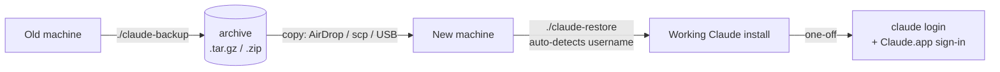
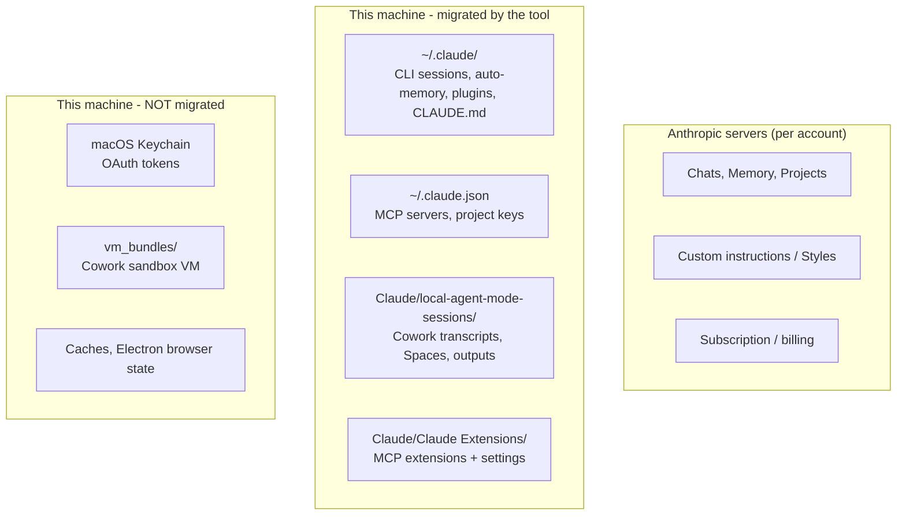

# Claude migration scripts

Move Claude Code (CLI + UI) and Claude Desktop (incl. Cowork) state from one machine to another.

**Version:** v0.1.0 — MIT-licensed.

Two parallel implementations are provided:

| Platform | Backup | Restore |
| --- | --- | --- |
| macOS (bash) | `claude-backup.sh` | `claude-restore.sh` |
| Windows (PowerShell) | `claude-backup.ps1` | `claude-restore.ps1` |

## Test status

| What | Status |
| --- | --- |
| macOS backup → archive integrity → dry-run restore → username remap (simulated against a fake `$HOME`) | **Tested** on macOS 15 (Darwin 25.5.0, arm64) against Claude Code CLI 2.1.153 + Claude Desktop with Cowork enabled. |
| macOS full restore over a real install (move-aside → overwrite → relaunch Claude.app) | **Not runtime-tested.** The logic is straightforward but exercising it would require clobbering a live install or using a separate test account / VM. |
| Windows backup, restore, and remap | **Not runtime-tested.** Direct port of the macOS logic, syntax-reviewed only. PowerShell isn't on the author's machine. Run with `-DryRun` first. |
| Cross-platform (Mac↔Windows) restore | **Not supported.** Both restore scripts detect and refuse a foreign-platform archive. |
| Linux | **Not addressed.** Claude Code CLI runs on Linux but Claude Desktop / Cowork does not, so a separate Linux backup script would only cover `~/.claude*`. PRs welcome. |

Treat this as a v0.1 of a community tool, not a battle-tested utility.

Cross-platform migrations (Mac→Windows or Windows→Mac) are **not** supported by these scripts: the encoded project-directory format is platform-specific (`/Users/olv` becomes `-Users-olv-` on macOS, but `C:\Users\olv` becomes `-C--Users-olv-` on Windows). The restore script will detect a cross-platform archive and refuse to run.

## At a glance



## TL;DR (macOS)

```bash
# On the old Mac
./claude-backup.sh                # writes ~/claude-migration-YYYYMMDD-HHMMSS.tar.gz

# Move the archive across (AirDrop / scp / USB).

# On the new Mac (after installing Claude.app and the Claude Code CLI)
./claude-restore.sh ~/claude-migration-*.tar.gz --dry-run
./claude-restore.sh ~/claude-migration-*.tar.gz
```

Then on the new Mac: run `claude` once to re-authenticate, and launch Claude.app and sign in.

## TL;DR (Windows)

**Do I need to install anything?** No. Windows PowerShell 5.1 ships with Windows 10 and 11. To open it, press **Win+X** and pick **"Terminal"** (Windows 11) or **"Windows PowerShell"** (Windows 10), or type `powershell` in the Start menu. The scripts use only cmdlets that exist in stock 5.1 (`Compress-Archive`, `Expand-Archive`, `Copy-Item`, etc.), so PowerShell 7 / `pwsh` is not required.

```powershell
# On the old PC
.\claude-backup.ps1                # writes %USERPROFILE%\claude-migration-<ts>.zip

# Move the .zip across (OneDrive / USB / scp).

# On the new PC (after installing Claude Desktop and the Claude Code CLI)
.\claude-restore.ps1 -Archive C:\path\claude-migration-*.zip -DryRun
.\claude-restore.ps1 -Archive C:\path\claude-migration-*.zip
```

Then on the new PC: run `claude` once to re-authenticate, and launch Claude Desktop and sign in.

### If PowerShell refuses to run the script

By default Windows blocks unsigned `.ps1` files. Two ways around it — neither requires admin rights and neither changes anything permanently:

**A. Allow scripts for the current PowerShell window only:**

```powershell
Set-ExecutionPolicy -Scope Process -ExecutionPolicy Bypass
.\claude-restore.ps1 -Archive C:\path\to\claude-migration.zip -DryRun
```

`-Scope Process` only affects the PowerShell window you're in. Close it and the default policy is back.

**B. Invoke without changing policy at all** (works from `cmd.exe`, the Run dialog, or PowerShell):

```cmd
powershell -ExecutionPolicy Bypass -File .\claude-restore.ps1 -Archive C:\path\to\claude-migration.zip -DryRun
```

## Step-by-step walkthrough (for first-time users)

If you've never used Terminal or PowerShell before, follow these. Each step explains what's happening so you know what to expect.

<details>
<summary><strong>On macOS</strong></summary>

### 1. Open Terminal

`Applications → Utilities → Terminal`, or press `⌘ Space` and type `Terminal` then Enter. A black window opens with a prompt waiting for commands.

### 2. Download the scripts

Pick **one** of the following options:

- **Easiest (no git needed)** — go to <https://github.com/OhJayGee/claude-migration>, click the green **Code** button → **Download ZIP**, and unzip it (double-click the downloaded file). The folder is your scripts.
- **With git** — paste this in Terminal and press Enter:
  ```bash
  cd ~ && git clone https://github.com/OhJayGee/claude-migration.git
  ```

In either case, change into the folder:
```bash
cd ~/Downloads/claude-migration-main    # if you used the ZIP
cd ~/claude-migration                    # if you used git clone
```

### 3. Make the scripts runnable (only needed for ZIP downloads)

```bash
chmod +x claude-backup.sh claude-restore.sh
```

This tells macOS the files are executable.

### 4. Run the backup

```bash
./claude-backup.sh
```

You'll see status lines as it works (`[backup] Staging…`). When it finishes (usually 30 seconds to a few minutes), it prints something like:
```
[backup] Done: /Users/you/claude-migration-20260528-103000.tar.gz (113M)
```

That `.tar.gz` file in your home folder is your backup. Make a note of its full path.

To also bundle your project source code (see "Optional: bundle project working trees" above for trade-offs):
```bash
./claude-backup.sh --include-projects
```

### 5. Transfer the backup file to the new Mac

Pick whichever you find easiest. From fastest/simplest to most flexible:

| Method | When to use it |
|---|---|
| **AirDrop** | Both Macs near each other. In Finder, right-click the `.tar.gz` → Share → AirDrop. |
| **USB drive** | No network. Plug it in, drag the file onto it, plug into the new Mac, drag off. |
| **iCloud Drive / Dropbox / Google Drive / OneDrive** | Both Macs signed into the same account. Drag the file into the synced folder; wait for it to upload, then it'll appear on the new Mac. |
| **A direct network copy** (`scp`) | If you're comfortable with SSH. Replace the example: `scp ~/claude-migration-*.tar.gz user@newmac.local:~/`. |
| **WeTransfer / Send Anywhere / Magic Wormhole** | The archive is very big (`--include-projects` with lots of code) and you need to send it over the internet. |

For most people: AirDrop if both Macs are within Bluetooth range, otherwise iCloud Drive.

### 6. On the new Mac

Install Claude.app (from <https://claude.ai/download>) and the Claude Code CLI (run this in Terminal):
```bash
curl -fsSL https://claude.ai/install.sh | bash
```

Then download the scripts the same way as step 2 above, change into the folder, and run a **dry-run** first to see what's about to happen:
```bash
./claude-restore.sh ~/claude-migration-20260528-103000.tar.gz --dry-run
```

Replace the filename with the actual path of the archive you copied over.

If the dry-run looks right, run the real restore:
```bash
./claude-restore.sh ~/claude-migration-20260528-103000.tar.gz
```

It will ask you to confirm. Type `y` and press Enter.

### 7. Finish

The restore script ends with a numbered list of remaining steps:
1. Run `claude` once, complete the login that opens in your browser.
2. Open Claude.app and sign in.

That's it. Open a project and try a session — your old sessions, plugins, MCP extensions, and Cowork Spaces should be there.

</details>

<details>
<summary><strong>On Windows</strong></summary>

### 1. Open PowerShell

Press `Win + X` and click **Terminal** (Windows 11) or **Windows PowerShell** (Windows 10). A window opens with a prompt waiting for commands. PowerShell 5.1 is preinstalled on every supported Windows; nothing to download.

### 2. Download the scripts

Go to <https://github.com/OhJayGee/claude-migration> in your browser, click the green **Code** button → **Download ZIP**. Open the downloaded ZIP and extract it (right-click → Extract All). Then in PowerShell:

```powershell
cd $HOME\Downloads\claude-migration-main
```

(Adjust the path if you extracted somewhere else.)

### 3. Allow the scripts to run (one-line, per-window only)

By default Windows blocks unsigned scripts. Allow them just for this PowerShell window:
```powershell
Set-ExecutionPolicy -Scope Process -ExecutionPolicy Bypass
```

This change vanishes when you close the window — nothing permanent is altered.

### 4. Run the backup

```powershell
.\claude-backup.ps1
```

You'll see `[backup]` status lines, then a final line like:
```
[backup] Done: C:\Users\you\claude-migration-20260528-103000.zip (113.4 MiB)
```

Note the full path of the `.zip` file. To also bundle your project source code:
```powershell
.\claude-backup.ps1 -IncludeProjects
```

### 5. Transfer the backup file to the new PC

| Method | When to use it |
|---|---|
| **USB drive** | No network. Drag the `.zip` onto a flash drive, plug into the new PC, drag off. |
| **OneDrive / Dropbox / Google Drive** | Both PCs signed into the same account. Drag the `.zip` into the synced folder; wait, it'll appear on the new PC. |
| **Network share (SMB)** | Both PCs on the same LAN. Right-click the file → Send To → a mapped network drive. |
| **WeTransfer / Send Anywhere** | Very big archive sent over the internet. |

### 6. On the new PC

Install Claude Desktop from <https://claude.ai/download> and the Claude Code CLI from <https://claude.ai/install>.

Then download the scripts (step 2) and run a dry-run first:

```powershell
Set-ExecutionPolicy -Scope Process -ExecutionPolicy Bypass
.\claude-restore.ps1 -Archive C:\Users\you\claude-migration-20260528-103000.zip -DryRun
```

If the dry-run looks right, run the real restore:

```powershell
.\claude-restore.ps1 -Archive C:\Users\you\claude-migration-20260528-103000.zip
```

Type `y` at the confirmation prompt.

### 7. Finish

Same as on Mac: run `claude` once to log in via the browser; open Claude Desktop and sign in. Your sessions, plugins, MCP extensions, and Cowork Spaces should appear.

</details>

If you get stuck at any step, copy the error message and open an issue: <https://github.com/OhJayGee/claude-migration/issues>.

## Why a script and not an official Anthropic flow

There is no official Anthropic-blessed migration tool. The only first-party migration documentation is the **chat-memory** import/export at <https://support.claude.com/en/articles/12123587-import-and-export-your-memory-from-claude> — that covers the cross-conversation memory in Claude.app / claude.ai (server-side, per account) but **not** local files, MCP config, plugins, projects, Cowork sessions, or anything in `~/.claude/`.

This script bundles all those local pieces.

## What gets copied

Paths use macOS notation. Windows equivalents:

| macOS | Windows |
| --- | --- |
| `~/.claude.json` | `%USERPROFILE%\.claude.json` |
| `~/.claude/` | `%USERPROFILE%\.claude\` |
| `~/Library/Application Support/Claude/` | `%APPDATA%\Claude\` |
| `~/Library/Preferences/com.anthropic.claudefordesktop.plist` | not used on Windows (Electron prefs live inside `%APPDATA%\Claude\`) |

### Claude Code (CLI)
- `~/.claude.json` — user ID, MCP server registrations, per-project trust state, onboarding flags
- `~/.claude/settings.json`, `settings.local.json`
- `~/.claude/projects/` — **auto memory + recorded sessions per project** (typically the largest item)
- `~/.claude/plugins/` — installed plugins, marketplaces, plugin data
- `~/.claude/agents/`, `skills/`, `tasks/`, `plans/`, `statusline/`, `config/`, `file-history/`

### Claude Desktop (incl. Cowork)
- `claude_desktop_config.json` — MCP servers + Desktop preferences (Cowork toggles, paired browser id, trusted folders…)
- `Preferences`, `config.json`, `window-state.json`, `bridge-state.json`, `buddy-tokens.json`, `cowork-enabled-cli-ops.json`, `extensions-installations.json`, `extensions-blocklist.json`
- `Claude Extensions/` + `Claude Extensions Settings/` — installed MCP extensions (e.g. filesystem, chrome-control, third-party `.mcpb` extensions) and their per-extension config
- `claude-code-sessions/` — Claude Code panels opened from inside the app
- `local-agent-mode-sessions/` — **Cowork chat sessions**
- macOS only: `~/Library/Preferences/com.anthropic.claudefordesktop.plist`, `~/Library/Application Support/Claude-3p/` (secondary install)

### Shell environment
The script captures any line in `~/.zshrc`/`~/.zshenv`/`~/.zprofile`/`~/.bashrc`/`~/.bash_profile` that mentions `CLAUDE` or `ANTHROPIC` into `env-vars.txt`. The restore script **prints** these for you to paste into the new machine's shell rc — it never edits your shell profile directly.

## What gets skipped (and why)

Things the backup deliberately leaves out, because including them would either bloat the archive or break on the new machine.

| Skipped | Why |
|---|---|
| Caches: `Cache/`, `Code Cache/`, `GPUCache/`, `Dawn*Cache/`, `~/.claude/cache`, `image-cache`, `paste-cache`, `shell-snapshots`, `~/Library/Caches/claude-*` | Regenerate on first launch. |
| Versioned runtime caches: `vm_bundles/`, `claude-code-vm/`, `claude-code/` | 5–10 GB each. The new machine downloads or re-provisions them. |
| Electron browser state: `Cookies*`, `IndexedDB/`, `Local Storage/`, `Session Storage/`, `Trust Tokens*`, `TransportSecurity` | You'll sign in again on the new machine anyway. |
| Crash + telemetry: `Crashpad/`, `sentry/`, `~/Library/Logs/Claude/`, `~/.claude/telemetry`, `~/.claude/debug`, `security_warnings_state_*.json` | Diagnostic data tied to the old machine. |
| Anthropic OAuth tokens | Stored in macOS Keychain, not in any file. Re-login after restore. |
| The `claude` binary itself | Install with `curl -fsSL https://claude.ai/install.sh \| bash` (or your usual method). |

## After restore: things you still need to do yourself

The archive carries everything Claude stored on disk; a few things live elsewhere and need a one-off step on the new machine.

| Task | How |
|---|---|
| Sign in to Claude Code CLI | Run `claude`, complete the OAuth flow in the browser. |
| Sign in to Claude.app | Launch the app, sign in. MCP extensions and Cowork sessions appear after sign-in. |
| Re-import Claude.app chat Memory **(only if moving across accounts)** | Use [Anthropic's memory import/export](https://support.claude.com/en/articles/12123587-import-and-export-your-memory-from-claude). Same account = nothing to do; Memory is server-side. |
| API keys & service tokens from your shell rc | Captured into `env-vars.txt` in the archive — paste into the new machine's `~/.zshrc` / `~/.zshenv`. |
| MCP-server / third-party credentials stored in macOS Keychain | Re-enter when the extension prompts you. |
| Per-repo `CLAUDE.md`, `.mcp.json`, `.claude/` directories | Travel with the repo. `git clone` / `git pull` / `rsync` of the working tree brings them along. |
| Source code in your project trees (e.g. `~/SRC/foo/`) | Move with the same workflow you'd use for any code. The migration only carries Claude's *metadata* about these projects (paths, trust state, auto-memory, session transcripts) — not the files inside them. |

## Optional: bundle project working trees

By default the script migrates only Claude's *metadata* about your projects — the session transcripts, auto-memory, MCP config, plugin state, etc. The actual source code in your project directories is left alone (move it with `git push`/`clone` or `rsync`, the way you'd move any code).

If your projects don't have a git remote, or you want a single-archive workflow that carries everything in one tarball, pass `--include-projects` to the backup:

```bash
./claude-backup.sh --include-projects                      # filtered (recommended)
./claude-backup.sh --include-projects --no-default-excludes  # verbatim
```

PowerShell equivalent:

```powershell
.\claude-backup.ps1 -IncludeProjects                     # filtered (recommended)
.\claude-backup.ps1 -IncludeProjects -NoDefaultExcludes  # verbatim
```

### What the script discovers

| Source | What's read |
|---|---|
| `~/.claude.json` | every key under `projects` (full absolute paths) |
| `Claude/local-agent-mode-sessions/*/*/spaces.json` | every Cowork Space's `folders[].path` |

After deduplication, paths that don't exist on disk are dropped. So are paths that are too broad to bundle safely: the user's `$HOME` itself, and any top-level system folder (`Downloads`, `Desktop`, `Documents`, `Pictures`, `Music`, `Movies`/`Videos`, `Library`, `Applications`, `.Trash`, `OneDrive`, `AppData`).

The script then prints the surviving list with per-path sizes plus a total, and asks for confirmation before bundling. You can stop here if the list is wrong.

### Default excludes (filtered mode)

Junk directories and files the script skips by default:

```
.git/   node_modules/   __pycache__/   .venv/   venv/   .next/
dist/   build/   target/   .idea/   .vscode/
.DS_Store   Thumbs.db   desktop.ini   *.pyc
```

These usually account for 90 %+ of project size and are easily rebuilt on the new machine. Pass `--no-default-excludes` (bash) or `-NoDefaultExcludes` (PowerShell) to skip the filters entirely.

### Restore behavior

On the new machine, `claude-restore.sh` detects bundled projects via the `projects/.paths.txt` index inside the archive, then prompts before restoring. For each project:

1. The destination path is computed (with username remap if applicable).
2. If something already exists at the destination, it's moved to `~/claude-pre-restore-<ts>/projects/...` so the restore is undoable.
3. The project is unpacked from the archive into the destination path.

Pass `--skip-projects` (bash) or `-SkipProjects` (PowerShell) to ignore bundled projects even if the archive contains them.

### Trade-offs to know

- **Archive size**: filtered bundling typically adds 100 MB – a few GB, depending on how much code lives outside `.git/node_modules/build`. Verbatim mode (`--no-default-excludes`) can multiply that by 5–10×.
- **Not a substitute for git**: if a project has a git remote, that remote is canonical. Bundling adds an extra copy of code that's already preserved elsewhere. Use this option mainly for repos without remotes, or for non-git working dirs (notes, downloads, scratch).
- **Privacy**: the archive will contain every file in every bundled project (filtered or not). Treat the archive as if it were a `tar` of your `$HOME/SRC/`.
- **node_modules / build outputs are intentionally lost**: that's by design. Run `npm install` / `pip install -r requirements.txt` / etc. on the new machine.

## What each Claude surface stores, and what we capture

**Legend:** ✓ migrated by this script · ✗ deliberately skipped · — handled outside this script (server-side, or moves with your repo).

Paths below: `~/.claude/...` is the CLI; everything else under `Claude/` is shorthand for `~/Library/Application Support/Claude/` on macOS (`%APPDATA%\Claude\` on Windows).

| Surface | ✓✗— | Where it lives + notes |
|---|:---:|---|
| Chats (claude.ai / Claude.app sidebar) | — | Anthropic servers, per account. Sign in on the new machine; both clients show the same conversations. |
| Claude.app chat Memory | — | Anthropic servers. Use the [official import/export flow](https://support.claude.com/en/articles/12123587-import-and-export-your-memory-from-claude). |
| Claude.app Projects (with knowledge files) | — | Anthropic servers. Distinct from Claude Code's local "projects" and Cowork's local "Spaces". |
| Custom instructions / Styles | — | Anthropic servers. |
| Claude Code CLI sessions | ✓ | `~/.claude/projects/<encoded-cwd>/*.jsonl` — every project + transcript. |
| Claude Code panel (in Claude.app) | ✓ | Metadata in `Claude/claude-code-sessions/`; transcripts share `~/.claude/projects/` with the CLI. |
| Claude Code auto memory | ✓ | `~/.claude/projects/<encoded-cwd>/memory/`. |
| User `CLAUDE.md` + rules | ✓ | `~/.claude/CLAUDE.md`, `~/.claude/rules/`. |
| Per-repo `CLAUDE.md` / `.mcp.json` / `.claude/` | — | Lives inside each repo. Moves with the code (git, rsync). |
| Plugins | ✓ | `~/.claude/plugins/`. |
| Cowork session data | ✓ | `Claude/local-agent-mode-sessions/<acct>/<dev>/local_<uuid>/` — transcripts, `audit.jsonl`, plans, `outputs/`, `uploads/`. |
| Cowork Spaces (folders + instructions prompt) | ✓ | `…/local-agent-mode-sessions/<acct>/<dev>/spaces.json`. |
| Cowork enabled plugins / marketplaces | ✓ | `…/local-agent-mode-sessions/<acct>/<dev>/cowork_settings.json` + `cowork_plugins/`. |
| Cowork sandbox VM (rootfs + sessiondata) | ✗ | `Claude/vm_bundles/claudevm.bundle/` — ~11 GB Apple Virtualization image. New Mac provisions fresh. **Save in-VM work via Cowork's download UI before migrating** if it wasn't already downloaded back as an output. |
| MCP servers — CLI scope | ✓ | `~/.claude.json` (`mcpServers` key). |
| MCP servers — Desktop + Extensions | ✓ | `Claude/claude_desktop_config.json` + `Claude/Claude Extensions/` + `Claude/Claude Extensions Settings/`. Includes `.mcpb` extensions and per-extension settings. |
| OAuth tokens | ✗ | macOS Keychain. Re-login on the new Mac (`claude` then sign in to Claude.app). |
| Caches, Electron browser state, crash data | ✗ | Regenerate on first launch. |

## Different username on the new Mac

The archive embeds a `source.env` with the source `$HOME`/username. On restore, if the destination's `$HOME` differs, the script prompts to rewrite paths automatically.

**Rewritten:**

| Target | What changes |
|---|---|
| `~/.claude.json` | `projects` keys and other absolute-path references: `/Users/olduser/...` → `/Users/newuser/...`. |
| `~/.claude/projects/-Users-olduser-…/` | Directory names renamed to `-Users-newuser-…`. |
| `.json` / `.jsonl` / `.md` / `.txt` files under `~/.claude/`, `Claude/claude-code-sessions/`, `Claude/local-agent-mode-sessions/`, `Claude/Claude Extensions Settings/` | Every `/Users/olduser/` and `-Users-olduser-` is substituted. |
| `Claude/claude_desktop_config.json`, `Claude/config.json` | Includes the `localAgentModeTrustedFolders` Cowork pref and MCP-server `env` paths. |
| `~/Library/Preferences/com.anthropic.claudefordesktop.plist` | Binary plists are converted to XML first so `sed` can touch them. |

**Override flags:**

| Flag | Effect |
|---|---|
| `--remap-to=USER` | Force a target username (otherwise `$(basename "$HOME")`). |
| `--no-remap` | Skip rewriting. CLI session metadata tolerates stale keys, but Cowork trusted folders and the filesystem extension's `allowed_directories` won't work until you fix them by hand. |

**Deliberately NOT rewritten:**

| Item | Why |
|---|---|
| `~/.claude/file-history/*` | Content-hashed snapshots. Rewriting them would invalidate the hash lookup; the old paths are historical metadata, not active config. |
| `audit.jsonl` inside `Claude/local-agent-mode-sessions/.../local_<uuid>/` | Immutable HMAC-signed records of past Cowork conversations. Rewriting would invalidate the HMACs and there's no reason to — it's history, not state. |
| Anything not matching `*.json` / `*.jsonl` / `*.md` / `*.txt` | Keeps the remap from touching binary files or unintended content. |

## Safety

`claude-restore.sh`:
- Refuses to run if the archive isn't a valid claude-migration bundle.
- Quits `Claude.app` first (it writes config on exit and would clobber the restore).
- Moves any pre-existing `~/.claude`, `~/.claude.json`, and overwritten Desktop items into a timestamped `~/claude-pre-restore-YYYYMMDD-HHMMSS/` before writing.
- Supports `--dry-run` to print what *would* happen.

## Tested

Backup script was tested on the source machine; archive integrity verified with `tar -tzf` and the resulting MANIFEST.txt. Restore is intentionally idempotent and reversible (via the move-aside directory).

## FAQ

### Does it migrate files Claude created inside my project directory?

**No.** The migration only copies Claude's own state directories (`~/.claude/`, `~/.claude.json`, `~/Library/Application Support/Claude/` on macOS or `%APPDATA%\Claude\` on Windows). Anything Claude wrote into your actual project — e.g. a new source file at `~/SRC/my-project/foo.py`, generated build artifacts, edited docs — lives in the **project working tree**, not in any Claude directory. Move project trees the way you'd move any code: `git push` / `git clone` if it's a git repo, or `rsync -av` if it isn't.

After the project tree is on the new machine, the migration script's username remap will reconnect Claude's metadata to the new paths so `~/.claude/projects/-Users-newuser-SRC-my-project/` lines up with `/Users/newuser/SRC/my-project/`.

Two narrow exceptions where Claude **does** keep generated files inside its own config directory, and which therefore DO migrate:

1. **Cowork session outputs / uploads.** Each Cowork session has its own `outputs/` and `uploads/` directories under `~/Library/Application Support/Claude/local-agent-mode-sessions/<account>/<device>/local_<uuid>/`. Files Cowork explicitly exchanged with the host through the download / upload UI live there. They're inside the Claude config tree, so the backup grabs them.
2. **File history snapshots.** `~/.claude/file-history/` contains content-hashed snapshots of files Claude has edited (for undo). These migrate too. They reference the original on-disk paths as metadata but don't replace the live files.

Files that only ever existed **inside the Cowork sandbox VM** (and were never downloaded back to the host as outputs) are NOT migrated, because `vm_bundles/claudevm.bundle/rootfs.img` is intentionally skipped. Save anything you care about via Cowork's download UI before migrating.

### Does it migrate my Cowork space's description / instructions prompt?

**Yes.** Cowork "Spaces" and their per-space instructions are stored in:

```
~/Library/Application Support/Claude/local-agent-mode-sessions/<account>/<device>/spaces.json
```

Each entry looks roughly like:

```json
{
  "id": "...",
  "name": "Example space",
  "folders": [{ "path": "/Users/USER/SRC/Projects/Example" }],
  "instructions": "You are a senior reviewer for this codebase. Always ...",
  "origin": "user"
}
```

That file is inside the `local-agent-mode-sessions/` tree, which is already part of the backup whitelist. The username-remap step also rewrites the `folders[].path` values, so `/Users/olduser/...` becomes `/Users/newuser/...` correctly.

Note that the **enabled-plugins list** for Cowork (`cowork_settings.json` in the same directory, plus `enabledPlugins` / `extraKnownMarketplaces`) also migrates. After restore, when you open Claude.app on the new machine and sign in, your Spaces — including names, instructions, linked folders, and enabled knowledge-work plugins — should appear without further action.

### What about the Cowork sandbox's installed packages / VM state?

Not migrated. The Cowork VM disk (`vm_bundles/claudevm.bundle/rootfs.img`, typically ~10 GB) is intentionally excluded. The new machine provisions a fresh VM on first Cowork launch. If you customized the sandbox (e.g. `apt install` of extra tools), you'll need to redo that after migration.

### My friend's old machine is dead. Can I still restore?

Only if you (a) have the backup archive from before it died, and (b) can re-authenticate Claude on the new machine (which uses OAuth — server-side, separate from the migration). Without the archive there's nothing to restore from; the migration script doesn't pull anything from Anthropic's servers. Make a backup *before* the old machine becomes inaccessible.

### Where is the line between "lives on my machine" and "lives in Anthropic's cloud"?

Anything tied to your **Anthropic account identity** is server-side and follows the account, not the machine. Anything that names a **filesystem path**, runs against a **local process**, or caches local state is on your machine and is what this migration tool exists to move.



| Lives in the cloud (no migration needed — just sign in on the new machine) | Lives on your machine (this tool migrates it) |
| --- | --- |
| All claude.ai / Claude.app chat conversations and their artifacts | Claude Code CLI session transcripts (`~/.claude/projects/<encoded-cwd>/*.jsonl`) |
| Claude.app **Memory** (the cross-conversation memory feature) | Claude Code **auto memory** (`~/.claude/projects/<encoded-cwd>/memory/`) and user `CLAUDE.md` |
| Claude.app / claude.ai **Projects** (with their uploaded knowledge files and project instructions) | Claude Code "projects" entries in `~/.claude.json` (just paths + trust state) |
| **Custom instructions / Styles** in Claude.app preferences | Cowork **Space instructions** (`spaces.json`) |
| Your subscription / plan / billing | Claude Code plugins, skills, agents, statusline scripts |
| Claude.app theme + sidebar mode (re-applied per account at sign-in) | Window positions and per-machine UI state (`Preferences`, `window-state.json`) |
| Conversation usage history / cost reports | Local cache of usage stats (`stats-cache.json`, deliberately skipped — Claude refetches) |

Rule of thumb: **if it appears immediately after you sign in on a fresh device with no migration, it's server-side**. Chat history, Memory, Projects, Styles, and account settings are all in that bucket.

### What about my claude.ai "Projects" — the ones with project knowledge / instructions?

Server-side, per account. Sign in on the new machine and they're all there. The Claude.app sidebar will repopulate from Anthropic's API. Don't confuse these with **Cowork Spaces** (local-only, migrated by this tool — see the Space-description FAQ above) or with **Claude Code's `~/.claude/projects/` entries** (also local-only, also migrated — these track CLI/panel sessions, not knowledge-base projects).

### What about Claude.app theme / appearance / design preferences?

Mostly server-side. Theme, sidebar mode, "compact" view, color scheme, and similar UI choices are stored per account and applied on first sign-in to any device. Locally cached UI state — last window size, scroll positions, pinned panels — lives in `Preferences` and `window-state.json` and *does* migrate, but it's not worth worrying about: a couple of clicks on the new machine reconfigures whatever doesn't carry across.

### How do the different "memory" layers relate, and which one migrates?

There are three distinct mechanisms with confusingly similar names:

| Layer | Where it lives | Migrates via this tool? |
| --- | --- | --- |
| **Claude.app Memory** — the cross-conversation memory feature you see in Settings → Capabilities → Memory | Anthropic servers, per account | No (not needed). Sign in on the new machine and it's there. To copy between accounts, use the [official import/export flow](https://support.claude.com/en/articles/12123587-import-and-export-your-memory-from-claude). |
| **Claude Code auto memory** — notes Claude takes inside `~/.claude/projects/<encoded-cwd>/memory/MEMORY.md` | Local, per project under `~/.claude/projects/` | **Yes** — included automatically. |
| **`CLAUDE.md` files** — the human-written persistent instructions | User-level `~/.claude/CLAUDE.md` is local; project-level `CLAUDE.md` lives inside each repo | User-level: **yes**. Project-level: travels with the repo via git/rsync, not via this tool. |

### Will all my MCP servers and Claude Extensions work on the new machine?

Mostly, but two ways they can break:

1. **Hard-coded paths in MCP `command` / `env`.** Your `claude_desktop_config.json` (or `~/.claude.json` for the CLI) may have entries like `"command": "/opt/homebrew/bin/codex"` or `"env": { "HOME": "/Users/olv" }`. If the new machine is the same architecture and has Homebrew at the same path, these still work. If you've switched from Apple Silicon to Intel Mac (where Homebrew lives at `/usr/local/bin/...`) or to a different package manager, you'll need to edit the JSON.
2. **API keys / tokens for MCP servers** (GitHub PAT, OpenAI key, etc.). If they're in your shell rc, they were captured into `env-vars.txt` and you paste them manually. If they're stored inside an MCP's own config (e.g. an extension's settings JSON), they migrate as part of `Claude Extensions Settings/` — but anything stored in macOS Keychain does not migrate and must be re-entered.

After restore, run `claude mcp list` (CLI) and check the MCP panel in Claude.app to confirm everything connects. Look in `~/Library/Logs/Claude/mcp-server-*.log` if an MCP doesn't show up.

### Will my Claude Extensions work if I'm migrating between different CPU architectures?

Possibly not for some of them. Several MCP extensions ship `node_modules` with prebuilt native bindings — on this machine I see `darwin-arm64` builds of `fsevents`, `lightningcss`, `@napi-rs/canvas`, `@rolldown/binding`, etc. inside `Claude Extensions/`. Those `.node` files are architecture-specific.

- **Same arch Mac → Mac** (e.g. Apple Silicon → Apple Silicon): everything works.
- **Apple Silicon → Intel Mac** (or vice versa): extensions with native bindings will likely fail to load. The fix is to uninstall and reinstall those extensions on the new machine after migration — settings (`Claude Extensions Settings/*.json`) will be reused if the extension is reinstalled with the same id.
- **Mac → Windows / Windows → Mac**: this tool refuses to do cross-platform migration entirely, partly for exactly this reason.

### Will the Anthropic Chrome extension still be paired after migration?

No, you'll need to re-pair. The `chromeExtension.pairedDeviceId` value in `claude_desktop_config.json` is an identifier for the *browser on the old machine*. The new machine's browser is a different "device" from Claude.app's point of view, so after migration: install the Anthropic Chrome extension in Chrome on the new machine and run through the pair-this-device flow again from Claude.app's settings.

### What about macOS notification / accessibility / Full Disk Access permissions?

Those are stored by macOS in a per-machine database (`TCC.db`), not in any user-readable config file, and they explicitly do not transfer across machines for security reasons. On the new Mac, the first time Claude.app or Claude Code needs to read your screen, post a notification, or watch the filesystem, macOS will re-prompt for permission. Grant it then.

### Can I resume a Claude Code session that was active on the old machine?

The session transcript and its plan migrate (everything Claude Code writes to `~/.claude/projects/.../` and `~/.claude/plans/`), so on the new machine you can do `claude --continue` or `claude --resume <sessionId>` and pick up the conversation. What does NOT migrate:

- Any background subprocess that was running (`claude --loop`, a long shell command Claude had spawned, an MCP server's in-flight request). Those are dead the moment the old machine goes offline.
- Open IDE state, terminal scrollback, browser tabs Claude was driving via the Chrome extension.

For background `/schedule` items: the metadata that defines a schedule migrates with the rest of `~/.claude/`, but the actual firing depends on Claude Code being launched. If your schedules required a launchd entry or cron job, those live in `~/Library/LaunchAgents/` or `crontab -e` — not in `~/.claude/` — and would need to be set up by hand on the new machine. (On this install there's no Claude-related crontab or LaunchAgent beyond Claude.app's auto-updater, so for most users this is a non-issue.)

### I have multiple Anthropic accounts on this machine. Does that work?

Yes. Inside `local-agent-mode-sessions/`, `claude-code-sessions/`, and a few other paths, Claude separates data by **account UUID** as a subdirectory. The backup grabs all account subdirectories. On the new machine, you'll need to sign into each account once for its data to come back online.

### What about Claude for Excel, PowerPoint, and Word?

Those are **Microsoft Office Add-ins**, distributed through Microsoft AppSource and managed entirely by Office, not by Claude.app or Claude Code. They don't write anything into `~/Library/Application Support/Claude/` or `~/.claude/`, so this migration tool deliberately doesn't touch them — there's nothing on the Claude side to grab.

How the Office add-ins actually migrate:

- **The add-in install** is tied to your Microsoft 365 account / Office tenant, not to the machine. Sign into Office on the new computer and the add-in is available in the same place (Insert → Add-ins → My Add-ins, or the Home ribbon's Claude button if you'd previously pinned it).
- **Your Claude authentication inside the add-in** is a separate per-device sign-in. The add-in runs in a sandboxed web view inside Office, with its own session — sign-in does *not* carry across machines and isn't shared with Claude.app on the same Mac either.
- **Per-add-in cached data** (mostly transient session state) lives inside Office's per-app containers at `~/Library/Containers/com.microsoft.{Excel,Word,Powerpoint}/Data/Documents/wef/` on macOS. Office regenerates this on first use; not worth backing up.

So the migration steps for the Office side are: install / sign into Office on the new Mac, open the Claude add-in once in each app, sign in with your Anthropic account. The migration script handles none of this and doesn't need to.

If you've been using **Claude for Sheets / Docs / Slides on Google Workspace** instead, the same answer applies — those are Google add-ons, also tied to your Google account, also outside this tool's scope.

### Is anything sensitive in the archive? Can I share it with someone to debug a problem?

Yes, the archive is sensitive. It contains, at minimum:

- The full content of every Claude Code session you've ever run (`~/.claude/projects/.../*.jsonl`) — including code, commit messages, and anything you pasted into Claude.
- Every Cowork session's audit log (`local-agent-mode-sessions/.../audit.jsonl`), which records every message in both directions.
- Your Claude account UUID, statsig user ID, and various device IDs.
- The contents of `claude_desktop_config.json` and `Claude Extensions Settings/*.json`, which may include API keys (e.g. OpenAI / Gemini keys in MCP `env` blocks or `__encrypted__` placeholders that on inspection turn out to be obfuscated, not encrypted).
- File-history snapshots of files Claude has edited.

Treat the archive like a copy of your home directory: don't post it publicly; if you must share for debugging, redact MCP `env` blocks and `Claude Extensions Settings/*.json` first, or share only the specific files you're debugging. The archive does **not** contain your Anthropic OAuth token (that lives in the macOS Keychain and is intentionally not migrated).

## Sources

This script was designed by combining Anthropic's official Claude Code documentation, the official Claude.ai memory import/export support article, observations from inspecting an actual Claude Code + Claude Desktop install on macOS, and a few community references.

**Anthropic (official):**
- [Claude Code — Settings](https://code.claude.com/docs/en/settings) — file/directory hierarchy for `~/.claude/`, `~/.claude.json`, `.claude/`, settings layers, plugin/skill locations.
- [Claude Code — Memory](https://code.claude.com/docs/en/memory) — `CLAUDE.md` resolution order, auto memory directory at `~/.claude/projects/<project>/memory/`, scoping rules.
- [Claude Code — Hooks Guide](https://code.claude.com/docs/en/hooks-guide) (referenced for completeness on what config carries hooks).
- [Anthropic Support — Import and export your memory from Claude](https://support.claude.com/en/articles/12123587-import-and-export-your-memory-from-claude) — the only first-party memory-migration flow, scoped to the cross-conversation memory feature in Claude.app / claude.ai (server-side, per account).
- [GitHub issue: Session Export/Import for Cross-Machine Portability (anthropics/claude-code#18645)](https://github.com/anthropics/claude-code/issues/18645) — confirms there is no official cross-machine session/config migration tool.

**Community references reviewed for prior art (used as cross-checks, not copied):**
- [DRVBSS/cowork-migrate](https://github.com/DRVBSS/cowork-migrate) — narrower scope, Mac-to-Mac migration of Cowork (Local Agent Mode) sessions only.
- [jtklinger/claude-code-backup-guide](https://github.com/jtklinger/claude-code-backup-guide) — community write-up on backing up Claude Code state.
- [dirkstrauss.com — Claude Code Windows Migration Guide](https://dirkstrauss.com/claude-code-windows-migration-guide/) — Windows-equivalent of the same exercise.
- [gist: Claude Code `--continue` after directory `mv`](https://gist.github.com/gwpl/e0b78a711b4a6b2fc4b594c9b9fa2c4c) — explains how absolute paths in `~/.claude.json` and `~/.claude/projects/<encoded-cwd>/` interact when paths change.

**Direct inspection of an installed Claude environment** (used to validate which paths actually exist and what they store):
- `~/.claude/` and `~/.claude.json` on the source Mac.
- `~/Library/Application Support/Claude/` (Claude.app), including `claude_desktop_config.json`, `Claude Extensions/`, `Claude Extensions Settings/`, `claude-code-sessions/`, `local-agent-mode-sessions/`, `vm_bundles/`, `claude-code/`, `claude-code-vm/`.
- `~/Library/Preferences/com.anthropic.claudefordesktop.plist`.
- `~/Library/Caches/claude-cli-nodejs`, `~/Library/Logs/Claude/` (skipped — caches and logs).
- Reading the `cwd` field inside `claude-code-sessions/*.json` confirmed the Desktop "Claude Code" panels reuse the same `~/.claude/projects/<encoded-cwd>/<uuid>.jsonl` store as the standalone CLI.
